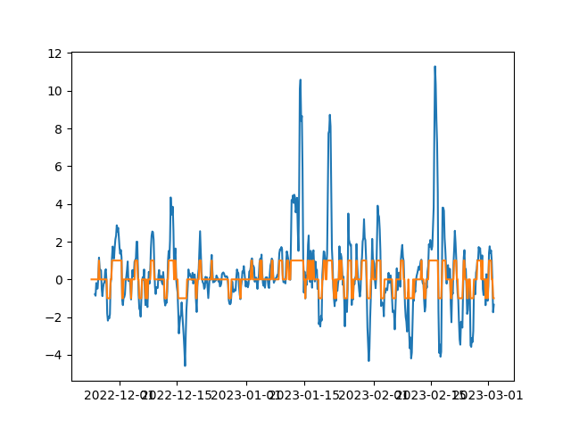

# Binance Data Crawler

By running main.py, you can get a ohlcv data and appropriate action based on your setting in config.json. In the main.py, it is setted to future market data, but you can change it in you favor.

Downloader.py is for downloading ohlcv data using your binance api.
You have to specify your binance api, your target symbol, data period, and data time frame.

Actor.py is for making a appropriate action based on your setting and ohlcv data.
You have to specify time step of percent change, triggering percent change(%). 
Also, you have to choose one from ohlcvm(open, high, low, close, mean) which is used for calculating percent change.
Mean is the average of high and low.
Action is [1, 0, -1], which is [long, do nothing, short].

This data can be used for training auto trading bot for binance.

The graph below is a result of a data based on following setting

~~~json
{
    "key": {
        "api_key": "",
        "secret": ""
    },
    "data":{
        "symbol": "BTC/USDT",
        "since": "2022-11-24T00:00:00Z",
        "timeframe": "4h"
    },
    "policy":{
        "timestep": 5,
        "trigger": 1,
        "ohlcvm": "mean"
    }
}
~~~

